# Fix: Hypervisor Not Running

You've already turned on **Virtual Machine Platform** and **Windows Hypervisor Platform** in Windows Features — but the Cowork Readiness Checker is still showing errors like:

- *"hypervisor not running"*
- *"missing vmcompute / HNS / vfpext"*
- *"WDAC policy present"*

This means the virtual machine feature is turned on, but something else on your computer is blocking it from starting. There are a few possible causes.

**Work through the steps below in order.** After each step, restart your computer and run the Cowork Readiness Checker again. Stop as soon as the errors are gone — you don't need to do every step.

---

## Step 1 — Check Memory Integrity (Core Isolation)

This is the **#1 cause** of "hypervisor not running" on personal PCs. Memory Integrity is a Windows security feature that, when turned on, can prevent the virtualization services Cowork needs from starting.

**1. Open the Start menu**

Type `Windows Security` and open it.  

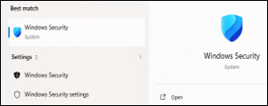  

**2. Go to Device Security**  

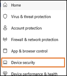  

Select **Device Security** → click **Core isolation details**.  

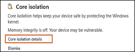  

**3. Check Memory Integrity**  

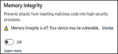  

- If Memory Integrity is **ON → turn it OFF**
- If Memory Integrity is **OFF → leave it off and skip to Step 2**

**4. Restart your computer**  

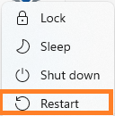 

**5. Run the Cowork Readiness Checker again**

✅ **Errors gone? You're done — ready to install Cowork!**

❌ **Still seeing errors? Continue to Step 2.**

---

## Step 2 — Check Reputation-Based Protection (Smart App Control)

Windows security settings can sometimes act as a "bouncer" that blocks Cowork's virtualization services from being approved to run.   
This step temporarily relaxes those restrictions so you can test whether they are the cause.

**1. Open the Start menu**

Type `App & browser control` and open it.  

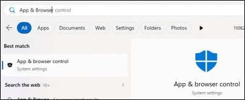 

**2. Go to Reputation-based protection settings** 

Click **Reputation-based protection settings**.  
 
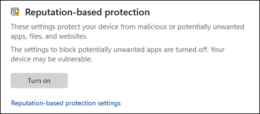 

**3. Temporarily turn OFF these three settings:**

- **Check apps and files**  

 

- **SmartScreen for Microsoft Edge**  

 

- **Potentially unwanted app blocking**  

 

!!! note "You can turn these back on later"
    These are temporary changes for testing. Once Cowork is running, you can turn them back on.

**If you see a message saying these are controlled by Smart App Control and can't be changed:**

- Go back one screen  

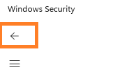

Select **Smart App Control settings**

 

- Click the radio button to turn Smart App Control **Off**  

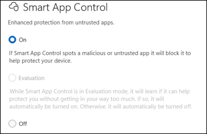 

- Click **Yes** in the pop-up that appears 

- Then return to **Reputation-based protection settings** and **turn off the three items listed in Step 2- #3 above**  

**4. Check Exploit Protection**

While still in App & browser control:

- Go back one screen

- Scroll down to **Exploit protection** → click **Exploit protection settings** 

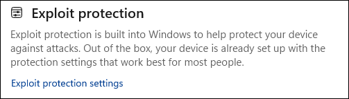 
 
- Select the **System settings** tab  

 

- Scroll to **Control flow guard (CFG)**  

 

- Make sure it is set to **Use default (On)**  

**5. Restart your computer**  

 

**6. Run the Cowork Readiness Checker again**

✅ **Errors gone? You're done — ready to install Cowork!**

❌ **Still seeing errors? Continue to Step 3.**

---

## Step 3 — Check if Virtualization is Enabled in Task Manager

Before going into your computer's hardware settings, this quick check tells you whether virtualization is switched off at the hardware level.

**1. Right-click on an empty area of your taskbar**

Select **Task Manager**.  

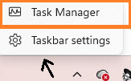 

**2. Click Performance → then CPU** 
 
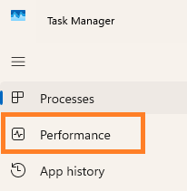 

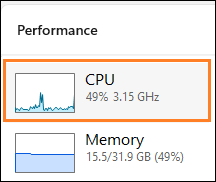 

At the bottom of the screen, look for **Virtualization**.  

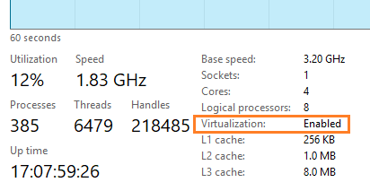 

You will see one of these:

| What it says | What it means |
|---|---|
| **Virtualization: Enabled** | Your hardware is fine — skip to Step 4 (antivirus check) |
| **Virtualization: Disabled** | You need to enable it in BIOS — continue to Step 3a below |
| **Virtualization: Not supported** | Your processor does not support virtualization. This is rare on modern PCs. |

---

### Step 3a — Enable Virtualization in BIOS/UEFI

!!! warning "Read this before you start"
    The BIOS controls low-level hardware settings. You should only change the virtualization option — do not adjust anything else. If your PC is less than 5 years old, virtualization is likely already enabled and you can skip this step.

**How to get into BIOS/UEFI:**

**1. Open Settings**

Type `Settings` in the search bar and click **Open**  

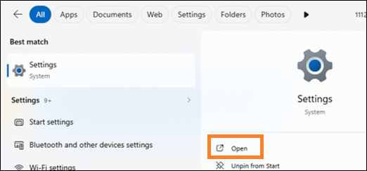 

**2. Go to Recovery**

Scroll to **Recovery** and click on it.  

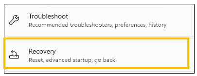 

**3. Click "Restart now" under Advanced startup**  

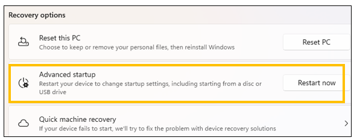 

Your computer will restart into a menu screen. 

**4. In the menu select:**  

Computer manufactures have menu screens with different appearances. You will look for these specific items in the menu- 

- **Troubleshoot**
- **Advanced options**
- **UEFI Firmware Settings**
- **Restart**

**What to look for once you're in BIOS/UEFI:**

Look for a setting with one of these names — they all mean the same thing:

- Intel Virtualization Technology
- Intel VT-x
- AMD-V
- SVM Mode
- Virtualization Support
- Virtual Machine Support

**What to do:**

- Set it to **Enabled**
- Save and exit — usually by pressing **F10**
There may be on screen instruction showing how to exit.

**What NOT to touch:**

| Setting | Leave it alone |
|---|---|
| Secure Boot | ⬜ Do not change |
| TPM | ⬜ Do not change |
| Boot order | ⬜ Do not change |
| Overclocking | ⬜ Do not change |
| C-states | ⬜ Do not change |
| Anything mentioning voltage or frequency | ⬜ Do not change |

**After saving and restarting:**

Open Task Manager → Performance → CPU and confirm it now says **Virtualization: Enabled**.

Then run the **Cowork Readiness Checker** again.

✅ **Errors gone? You're done — ready to install Cowork!**

❌ **Still seeing errors? Continue to Step 4.**

---

## Step 4 — Check for Antivirus Interference

Some antivirus programs block the hypervisor from starting in order to "protect" your system. This step temporarily disables that protection so you can test whether your antivirus is the cause.

**1. Open the Start menu**

Type `Windows Security` and open it.  

 

**2. Go to Virus & threat protection**  

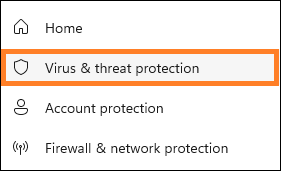 

Select **Virus & threat protection** → scroll to **Virus & threat protection settings** → click **Manage settings**.  

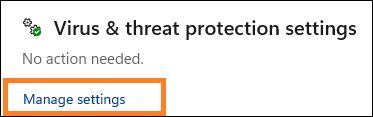 

**3. Temporarily turn OFF:**

- **Real-time protection**  

 

- **Tamper protection** (if present)  

 

!!! note "You can turn these back on after testing"
    If turning these off fixes the problem, you'll want to turn them back on and then look into your antivirus settings for a way to whitelist Cowork specifically.

**4. Restart your computer**  

 

**5. Run the Cowork Readiness Checker again**

✅ **Errors gone? You're done — ready to install Cowork!**

❌ **Still seeing errors? Continue to Step 5.**

---

## Step 5 — Check Device Encryption

Device Encryption can sometimes reserve the hypervisor in a way that prevents Cowork from using it.  

Claude Cowork runs a small virtual machine. On some Windows systems, Device Encryption or BitLocker can reserve the Windows hypervisor, preventing Cowork’s VM from starting.  

This issue is documented across multiple Cowork troubleshooting reports and aligns with Microsoft’s own guidance about BitLocker’s interaction with Hyper V.

!!! Note      Windows 11 Home users: If you are on Windows 11 Home, the Readiness Checker may have incorrectly reported that your system is ready — this is a known issue caused by the way Windows reports its version internally. Windows 11 Home is not a supported configuration for Cowork. This has been reported as being corrected in a Readiness Checker update.
 
!!! Note      Windows 10 users: Cowork requires Windows 10 build 17763 or higher (released October 2018). To check your build, go to Settings → System → About and look at the OS Build number. If your build is lower than 17763, Windows Update may be able to bring you current — but if your hardware is too old to upgrade, Cowork will not be supported.

**1. Open Settings**  

**2. Go to Privacy & security**   

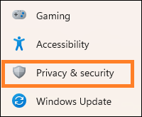 
   
- Select **Device Security**  

 

- If you see **Device Encryption, turn it OFF and restart**. or  

- If you see **BitLocker Drive Encryption, suspend or turn it OFF and restart**

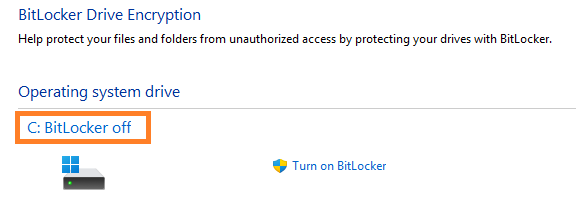 

**3. Run the Cowork Readiness Checker again**

✅ **Errors gone? You're done — ready to install Cowork!**

❌ **Still seeing errors? Continue to Step 6.**

---

## Step 6 — Check Windows Update

In rare cases, the hypervisor fails to start because of a missing Windows update.

**1. Open Settings → Windows Update**  

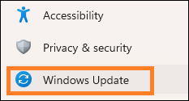 

**2. Click Check for updates**  

 

**3. Install all available updates**

**4. Restart your computer**  

 

**5. Run the Cowork Readiness Checker again**

✅ **Errors gone? You're done — ready to install Cowork!**

---

## Still not working?

If you've worked through all six steps and the errors are still there, the issue may be related to an application control policy on your computer. This is uncommon on personal PCs but can happen if you have certain security software installed.

👉 [Fix: Application control policy (WDAC)](fix-wdac-policy.md)

If your computer is managed by your employer, your IT department will need to assist.

👉 [IT email templates for Cowork virtualization errors](windows-it-email-templates.md)  

*ArchieCur created in collaboration with Claude Sonnet 4.6 (Anthropic) · v1.0.0 · June 2026*
