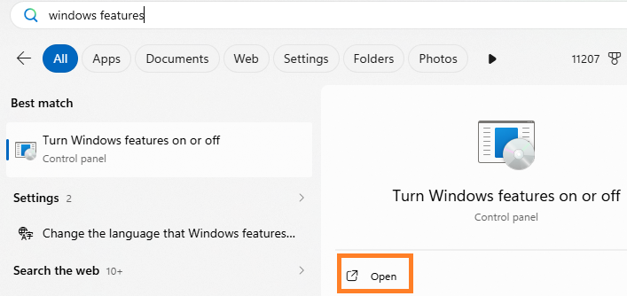

# Fix: Virtual Machine Platform is Turned Off

If you saw a red X next to **"Hardware Virtualization"** or **"Virtual Machine Platform"** in the Cowork Readiness Checker, this is the most common result — and usually the easiest fix.

Think of it like a power switch that just needs to be flipped on.

---

## What you'll do

You'll turn on two Windows features:

- **Virtual Machine Platform (VMP)**
- **Windows Hypervisor Platform (WHP)**

This takes about 5 minutes, and Windows will walk you through most of it.

---

## Step-by-step instructions

**1. Open the Start menu** 

- Click the Windows icon in the bottom-left corner of your screen.
 

**2. Search for Windows Features**

- Type: `Windows Features` and press **Enter**.  

- A window called **"Turn Windows features on or off"** will open.

**3. Find and check both features**

- Scroll through the list and check the box next to each of these:

- ✅ **Virtual Machine Platform**
- ✅ **Windows Hypervisor Platform**  

**4. Leave everything else alone**

Do **not** check any of the following — they can cause problems and Cowork does not need them:

| Feature | Leave it alone |
|---|---|
| Hyper-V | ⬜ Do not check |
| Hyper-V Platform | ⬜ Do not check |
| Hyper-V Management Tools | ⬜ Do not check |
| Windows Sandbox | ⬜ Do not check |
| Containers | ⬜ Do not check |

!!! warning "You may have seen Hyper-V mentioned — here's why you should still leave it alone"
    Cowork's architecture documentation and some forums and blog posts mention that Cowork uses Hyper-V on Windows under the hood. This is technically true- *but Cowork manages that automatically.* You do not need to turn it on yourself, and doing so will likely conflict with Cowork's own setup and create new problems. If you saw "enable Hyper-V" recommended somewhere online, that advice does not apply here. The only two features you need are the ones listed above.

**5. Click OK**  

[Click OK](../assets/virtual_machine/OK.png)

Windows will install the features. This may take a few minutes — let it finish.

**6. Restart your computer**  

- When prompted, restart. This step is required — the features won't activate until you do.

[Click OK](../assets/virtual_machine/Restart.png)

**7. Run the Cowork Readiness Checker again**

After restarting, open the checker. If the red X items are gone, you're ready to install Cowork. 🎉

---

## Still seeing red X items after restarting?

If the errors are still there after completing the steps above, something else is blocking the virtual machine from starting. This is less common but very fixable.

👉 [Fix: Hypervisor not running](fix-hypervisor-not-running.md)  

*ArchieCur created in collaboration with Claude Sonnet 4.6 (Anthropic) · v1.0.0 · June 2026*
